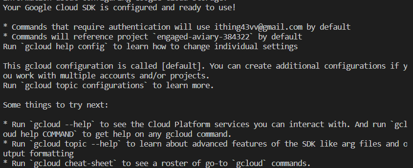

# Gcloud 설치 및 인증

- ubuntu 20.04 (wsl)

```bash
# WSL 터미널을 열고 패키지 리스트를 업데이트
$ sudo apt-get update

# curl과 gnupg 패키지를 설치
$ sudo apt-get install curl gnupg

# Cloud SDK를 다운로드하고 설치
$ curl https://sdk.cloud.google.com | bash

# gcloud를 초기화. 다음 명령어를 사용하면 CLI 명령어로 구글 계정을 통한 인증을 완료할 수 있다.
$ gcloud init

```
