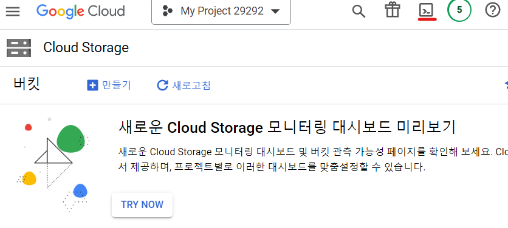
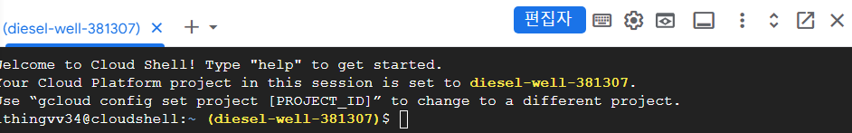
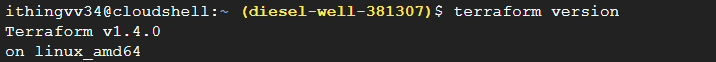
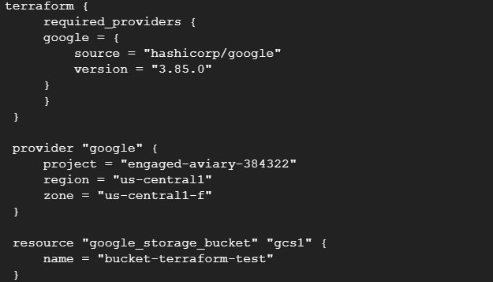
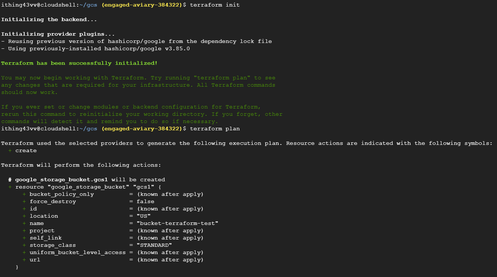
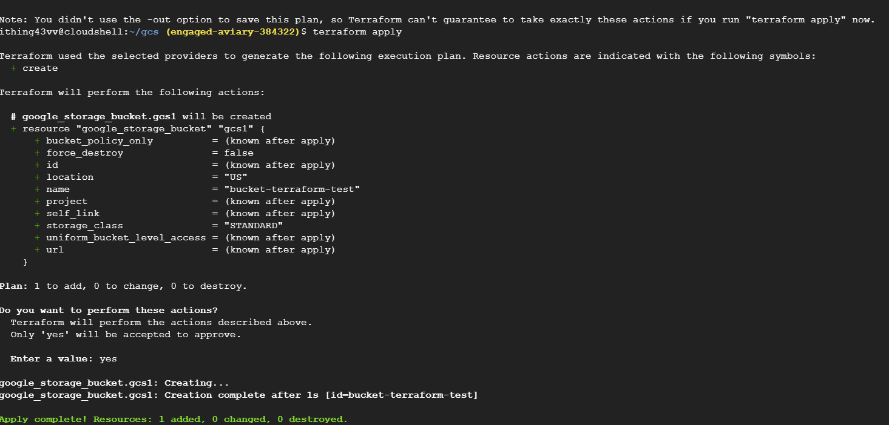

# Google Cloud Shell을 통한 인증

1. GCP Console에 접속하여 terraform 인프라를 설정할 프로젝트를 선택한다.
2. cloud shell에 접속한다.
<br>
   
   
<br>
3. terraform 버전을 확인한다.
    ```
    terraform version
    ```
    

4. vi 파일을 열어 main.tf 파일을 생성한다.
   ```
    mkdir gcs && cd gcs

    # vi main.tf

    terraform {
        required_providers {
        google = {
            source = "hashicorp/google"
            version = "3.85.0"
        }
        }
    }

    provider "google" {
        project = "PROJECT_ID" 
        region = "REGION_NAME"
        zone = "ZONE_NAME"
    }

    resource "google_storage_bucket" "MY_BUCEKT" {
        name = "MY_GCS_BUCKET"
        location = "LOCATION" 
    }

    # wq!
   ```


1. terraform 명령어로 GCS 생성
```terraform   
terraform init
terraform plan
terraform apply
```


1. 생성된 버킷 확인
    