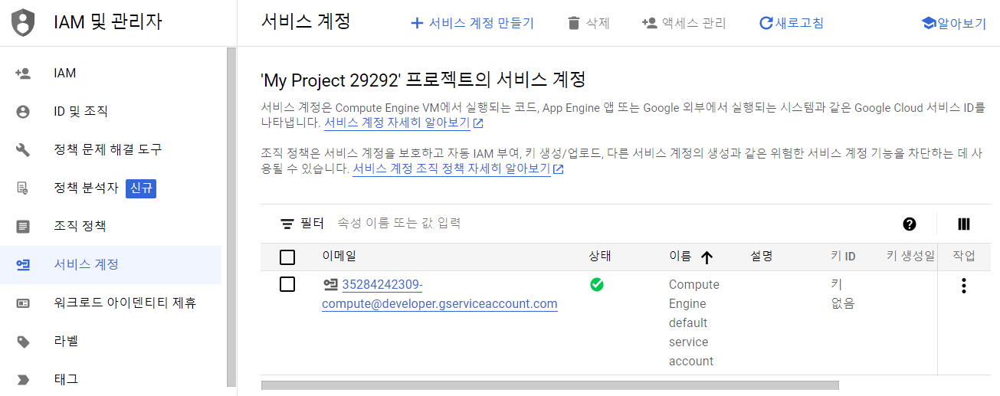
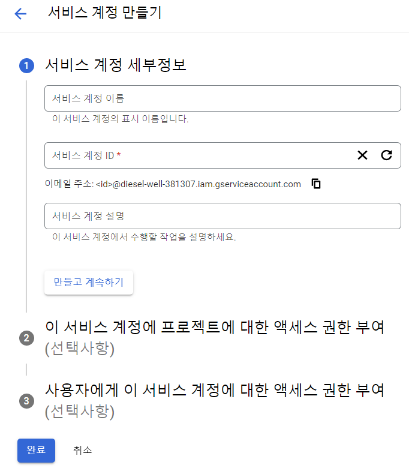
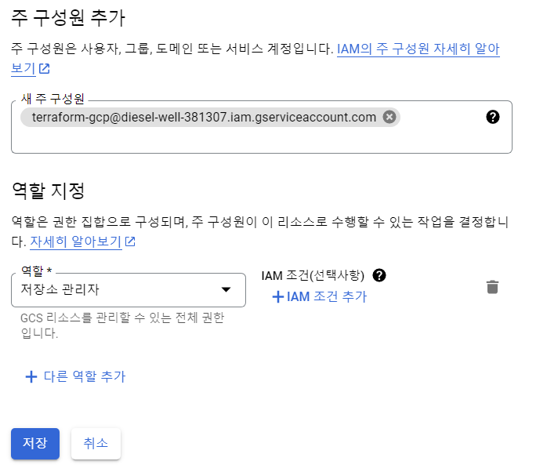
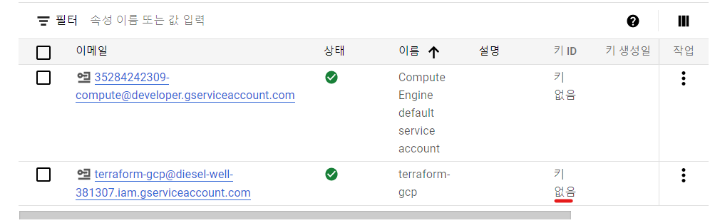
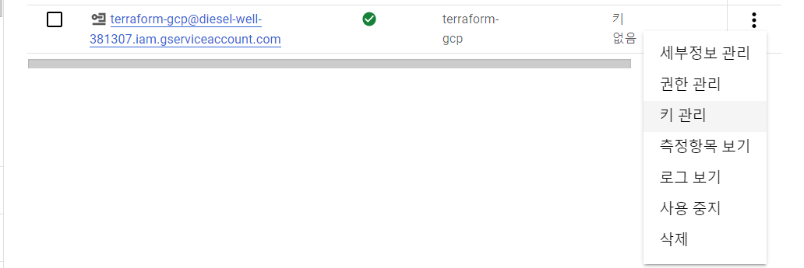
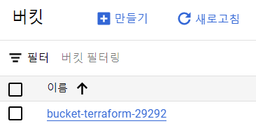

# Serviceacoount key 인증을 통해 GCS 생성하기

1. 프로젝트의 서비스 계정을 생성하기 위해 IAM 서비스 어카운트 탭 으로 이동한다.
    
2. 서비스 계정을 생성한다.
    
    `terraform-gcp@diesel-well-381307.iam.gserviceaccount.com`
3. 생성할 리소스의 role을 부여한다. GCS를 생성할 예정이므로 저장소 권한이 필요하다.
    
    
4. 아직 key를 생성하지 않은 상태이다.
   
5. 키 관리 버튼을 클릭하고 키를 추가한다. 포맷은 json으로 설정한다.
    
    
6. main.tf에서 다운로드 받은 key 파일의 경로를 credential에 추가한다.
   ```
    terraform {
        required_providers {
        google = {
            source = "hashicorp/google"
            version = "3.85.0"
        }
        }
    }

    provider "google" {
        project = "PROJECT_ID" # diesel-well-381307
        region = "REGION_NAME" # ex) us-central1
        zone = "ZONE_NAME" # ex) us-central1-f
        # key file의 경로
        credentials = "PATH/TO/KEYFILE" # ex) C:/Users/l2t/Desktop/temp/gcp_key/key.json
    }

    resource "google_storage_bucket" "gcs1" {
        name = "MY_GCS_BUCKET" # ex) "bucket-terraform-29292"
    }
   ```
7. terraform 명령어를 실행한다.
   ```
    terraform init
    terraform plan
    terraform apply
   ```
8. 생성된 버킷을 확인한다.
   