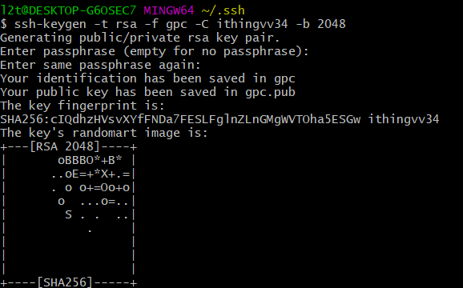
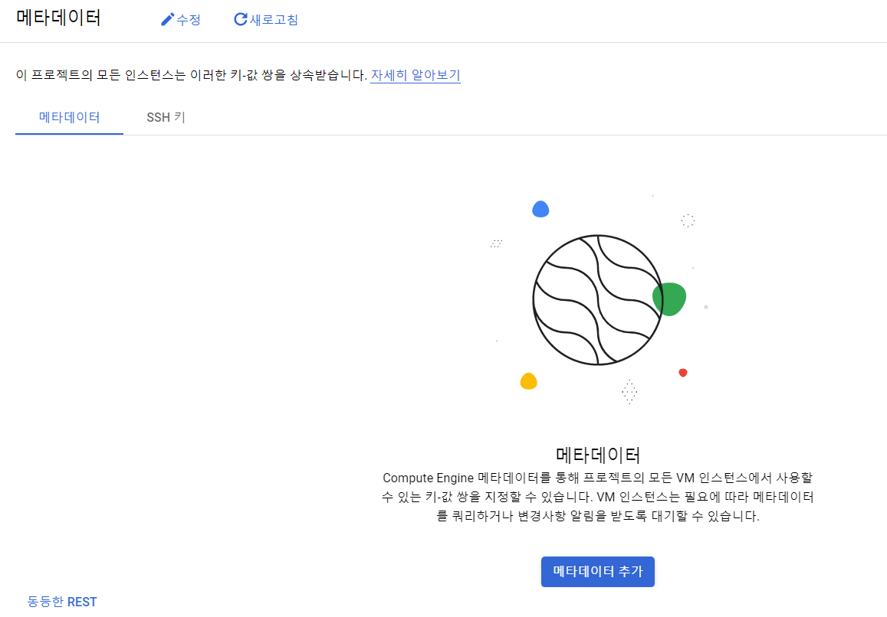
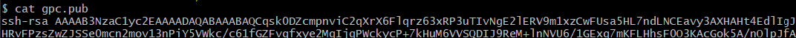
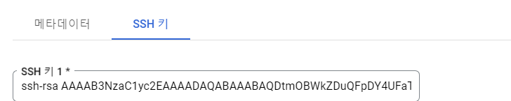
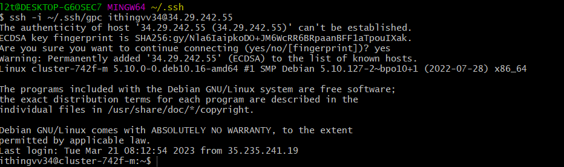
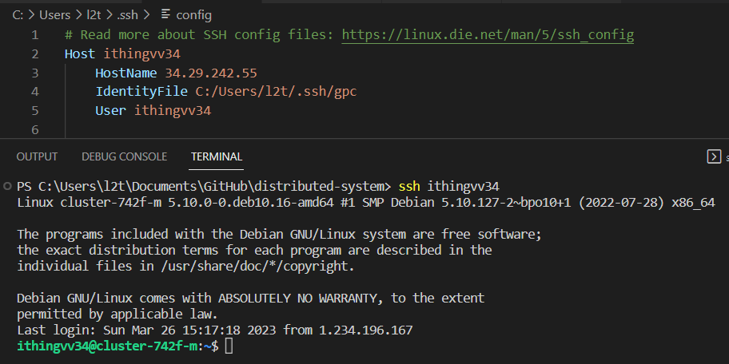
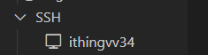

# Cloud VM + SSH access 환경 설정

1. 원격으로 Cloud VM에 접근하기 위해 ssh키를 생성한다.
   
- git bash 터미널을 열고 .ssh 폴더에 새로운 ssh키를 생성 아이디는 gcp 계정명과 일치해야한다.
  ```bash
    ssh-keygen -t rsa -f [key] -C [account] -b 2048
  ```
  

2. ssh 키 등록을 위해 Compute Engine의 메타데이터 탭에 들어간다
   
   

3. Public 키를 복사해서 SSH key에 추가한다.

    
    

4. Private key를 사용하여 vm에 엑세스할 수 있다.
    - vm의 외부 IP 주소 필요 
    ```
    ssh -i ~/.ssh/gpc ithingvv34@34.29.242.55
    ```
    

5. vscode ssh config에 ssh 키 경로를 설정하면 ssh 명령어로 바로 연결할 수도 있다.
   ```
   ssh ithingvv34
   ``` 
   


6. vscode의 remote explore를 통해 VM 인스턴스와 연결된 새로운 vscode 세션을 실행할 수 있다.
    
    

**참고자료**

[https://cloud.google.com/compute/docs/connect/windows-ssh?hl=ko]()