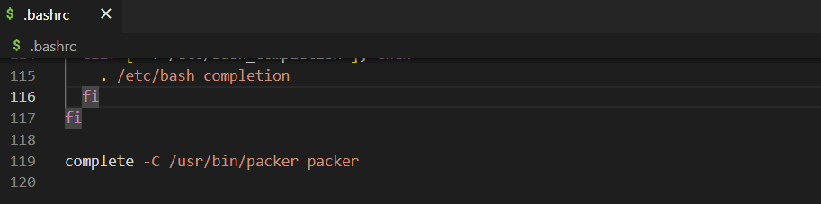

[1. 패커 설치 및 기본설정]()


**참고**
- [패커 Github](https://github.com/hashicorp/packer)
- [HashiCorp 공식 홈페이지의 Packer 설치가이드](https://developer.hashicorp.com/packer/downloads)

----
- 환경
  - Windows 10
  - WSL Ubuntu 22.04

```shell
wget -O- https://apt.releases.hashicorp.com/gpg | gpg --dearmor | sudo tee /usr/share/keyrings/hashicorp-archive-keyring.gpg

echo "deb [signed-by=/usr/share/keyrings/hashicorp-archive-keyring.gpg] https://apt.releases.hashicorp.com $(lsb_release -cs) main" | sudo tee /etc/apt/sources.list.d/hashicorp.list

sudo apt update && sudo apt install packer
```


- version 확인
```shell
packer -version
```


- packer 명령어 자동 완성 기능 활성화
```shell
packer -autocomplete-install
```

