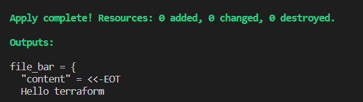

[1. 테라폼 설치 및 기본설정]()


**참고**
- [테라폼 Github](https://github.com/hashicorp/terraform)
- [HashiCorp 공식 홈페이지의 테라폼 설치가이드](https://developer.hashicorp.com/terraform/downloads)

----
- 환경
  - Windows 10
  - WSL Ubuntu 22.04

- 설치
```shell
wget -O- https://apt.releases.hashicorp.com/gpg | gpg --dearmor | sudo tee /usr/share/keyrings/hashicorp-archive-keyring.gpg

echo "deb [signed-by=/usr/share/keyrings/hashicorp-archive-keyring.gpg] https://apt.releases.hashicorp.com $(lsb_release -cs) main" | sudo tee /etc/apt/sources.list.d/hashicorp.list

sudo apt update && sudo apt install terraform
```


- version 확인
```shell
terraform -version
```


- terraform 명령어 자동 완성 기능 활성화
```shell
terraform -install-autocomplete
```


- [테라폼 캐시 설정](https://developer.hashicorp.com/terraform/cli/config/config-file)
  - 홈 디렉토리에 `.terraformrc` 파일을 (없다면) 생성하고 텍스트를 입력해야한다.
  - plugin cache 설정
    - 테라폼의 캐시 저장 공간을 중앙 집중식으로 관리
    - 각 워크스페이스마다 필요한 테라폼 프로바이더나 모듈을 다운로드 받을 때 동일한 파일의 경우 한번만 설치할 수 있도록 설정한다. 

```shell
# ~/.terraformrc
vi ~/.terraform.rc

# 텍스트 입력
plugin_cache_dir = "$HOME/.terraform.d/plugin-cache"

# 폴더 생성
mkdir ~/.terraform.d/plugin-cache
```


[테라폼 간단한 실습](../code/1-1/main.tf)

- 테라폼 워크스페이스 생성
  - 인프라를 관리하기 위한 하나의 프로젝트 단위
  - 변경사항을 추적하기 위해 상태관리가 필요하다.
  - tf.state에 상태가 저장되며 워크스페이스 단위로 관리된다.

- Write - Plan - Apply 워크플로우 실습
  - [local provider](https://registry.terraform.io/providers/hashicorp/local/latest/docs) 사용

```terraform

# main.tf

provider "local" {
  # Configuration options

}

resource "local_file" "foo" {
  content  = "Hello world"
  filename = "${path.module}/foo.txt"
}

$ alias tf=terraform

$ tf init

$ tf plan

# text 파일이 생성됨
$ tf apply
```


  
- 테라폼 워크스페이스 리소스 변경 및 제거
  - `datasource` 사용
  - 파일명을 변경하는 예시

```terraform
provider "local" {
  # Configuration options

}

resource "local_file" "foo" {
  content  = "Hello world"
  filename = "${path.module}/foo.txt"
}

# 추가
data "local_file" "bar" {
  filename = "${path.module}/bar.txt"
}

# 결과를 확인하고 싶은 경우
# file_bar라는 이름의 object가 생성됨
output "file_bar" {
  value = data.local_file.bar
}
```

```shell
# bar.txt 생성
$ cat > bar.txt
Hello terraform

$ terraform apply
```



---

- 테라폼 포맷팅
  
```shell
$ terraform fmt
$ terraform fmt -diff
```

