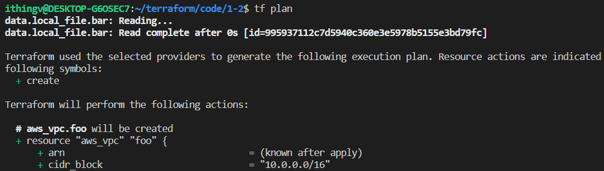
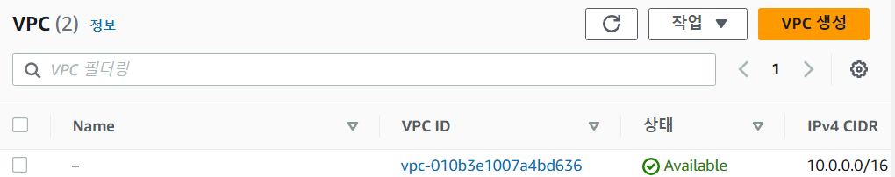
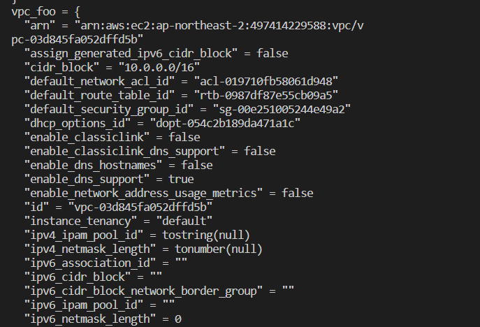

[2. Resource 와 Data]()

- 테라폼 워크스페이스 개념 이해 및 생성 방법
- 워크스페이스 리소스를 정의하고 plan을 통해 검토 후 Apply 적용하기
- 리소스 변경 시 수정을 통한 변경과 새로 생성되는 변경의 차이를 이해
- destroy를 통해 테라폼 워크스페이스 내 리소스를 모두 제거


- provider agnostic
  - terraform 이 여러 프로바이더를 지원해준다는 의미이다.
  - 테라폼 파일 하나로 gcp, aws, azure등 모든 provider를 관리할 수 있다는 의미는 아님(각 프로바이더마다 .tf 파일이 필요함.)


- [terraform registry](https://registry.terraform.io/)
    - provider (aws, gcp, azure, k8s 등)
    - module(인프라 리소스의 그룹 템플릿)을 제공

- aws cli 사용자 인증 설정 
  - aws 관리자 권한을 가지는 IAM을 생성하고 액세스키와 시크릿을 저장한다.
  - awscli를 설치하고 터미널에 aws configure을 입력하여 액세스키와 시크릿, 리전을 등록한다.

- [aws vpc 생성하기](../code/1-2/main.tf)
  
```terraform

# main.tf

resource "local_file" "foo" {
  content  = "Hello world"
  filename = "${path.module}/foo.txt"
}

# 추가
data "local_file" "bar" {
  filename = "${path.module}/bar.txt"
}

# 결과를 확인하고 싶은 경우
# file_bar라는 이름의 object가 생성됨
output "file_bar" {
  value = data.local_file.bar
}

resource "aws_vpc" "foo" {

    # cidr는 변경 가능한 속성이 아님
    # 변경될 경우 삭제 후 재생성 (force replacement)
    cidr_block = "10.0.0.0/16"

    tags = {
        "Name" : "This is test vpc" 
    }
}

output "vpc_foo" {
    value = aws_vpc.foo
}
```

```
$ tf init
$ tf plan
$ tf apply
$ tf destroy
```



- `vpc output`


