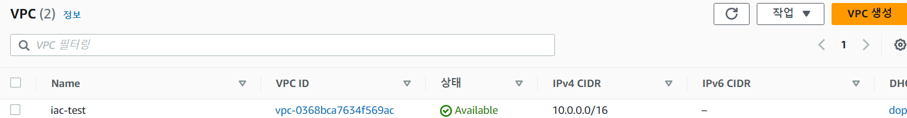
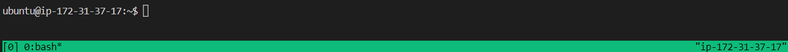
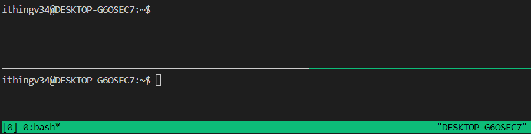
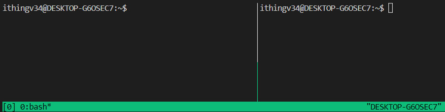
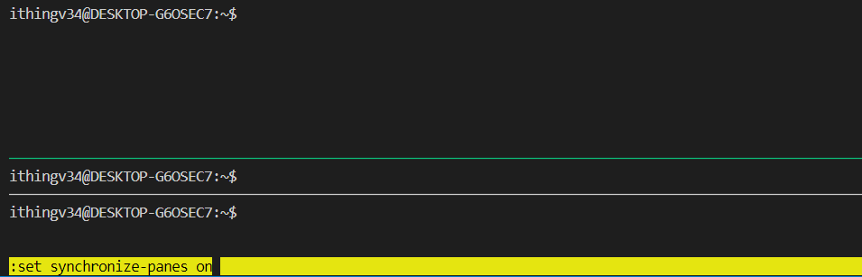
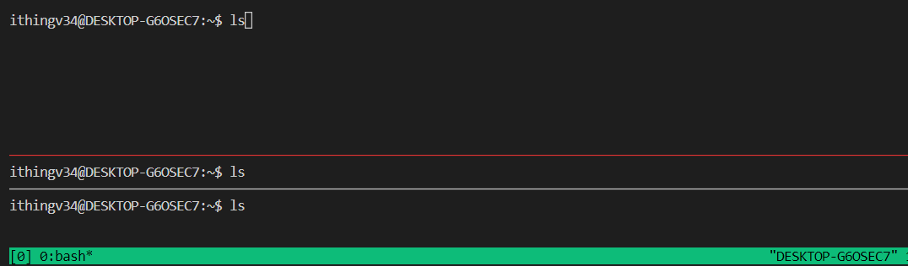
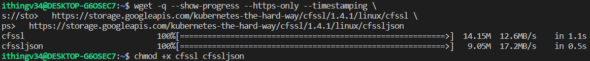
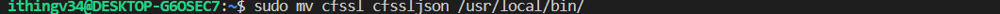
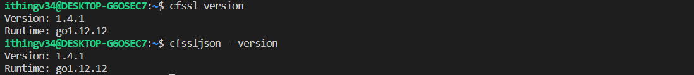
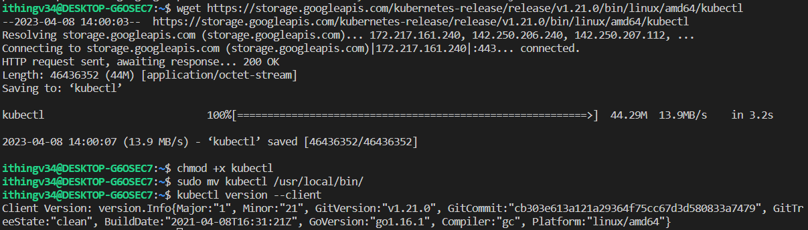

# 0. 필요 도구 설치

- 환경
    - [WSL에서 AWS EC2 서버와 SSH 연결](./wsl_ec2_ssh.md)
  
---

### AWS CLI

- aws cli 설치
  ```
  $ sudo apt update
  $ sudo apt install awscli
  ```
- aws cli vpc 생성 테스트
  ```
  $ VPC_ID=$(aws ec2 create-vpc --cidr-block 10.0.0.0/16 --output text --query 'Vpc.VpcId')
  $ aws ec2 create-tags --resources ${VPC_ID} --tags Key=Name,Value=iac-test
  $ aws ec2 modify-vpc-attribute --vpc-id ${VPC_ID} --enable-dns-support '{"Value": true}'
  $ aws ec2 modify-vpc-attribute --vpc-id ${VPC_ID} --enable-dns-hostnames '{"Value": true}'
  ```
  

---

### tmux

- 하나의 세션에 여러 터미널을 구성할 수 있는 도구
- 동일한 명령을 병렬로 실행할 수 있다.


**단축키**
```
# tmux 실행
$ tmux
```


```
# 창 세로로 분할
ctrl + b 누른 후 ""
```


```
# 창 가로로 분할
ctrl + b 누른 후 ""
```


```
# 화살표로 창간 이동 - "Ctrl+b 방향키"
# 창 사이를 전환하기 - "Ctrl+b 1"은 첫 번째 창으로 전환
# 세션에서 분리하기 - "Ctrl+b d"
# 분리된 세션에 다시 연결 - tmux attach
# 세션 종료 tmux kill-session
```

```
# 화면 입력 동기화 
Ctrl+b 누른 후 shift: set synchronize-panes on 을 입력
# 비활성화 
Ctrl+b 누른 후 shift: set synchronize-panes off 입력
```



- 터미널 접속 종료해도 쉘에서 작업이 계속 되도록 구성
  - `tmux`, `nohup`, `screen` 등을 사용
  
```shell
# 세션 명을 지정하여 tmux 실행
$ tmux new -s mysession

# 지속하려는 작업 실행
$ watch -n 3 ps

# tmux 세션에서 빠져나옴 
ctrl + b 입력 후 d

# 모든 tmux 세션 조회
$ tmux ls

# 타겟 세션에 연결
$ tmux attach -t mysession
```

---
### CFSSL

- Clusdflare에서 만든 `PKI` 와 `TLS`를 위한 도구
  - PKI(공개키 기반 인프라)를 구성하고 TLS 인증서를 생성하는데 사용
- PKI는 트랜잭션에 관련된 당사자들을 인증하기 위해 **공개키 기반 암호화**의 사용을 지원하는 기능, 정책 및 서비스의 시스템이다.
  - 활용사례: `HTTPS` , `SSH` , `인터넷 뱅킹` 등
  - 대표적인 인증서 표준 `X.509`
  
**설치 명령어 (Linux)**

- wget을 사용하여 Google Cloud Storage에서 두 개의 파일(cfssl 및 cfssljson)을 다운로드하는 Bash 셸로 작성된 명령어
```shell
$ wget -q --show-progress --https-only --timestamping \
  https://storage.googleapis.com/kubernetes-the-hard-way/cfssl/1.4.1/linux/cfssl \
  https://storage.googleapis.com/kubernetes-the-hard-way/cfssl/1.4.1/linux/cfssljson
```
- cfssl 및 cfssljson 파일의 파일 모드를 명령으로 실행할 수 있도록 실행 파일(+x)로 변경
```shell
chmod +x cfssl cfssljson
```
- 관리 권한이 필요한 sudo를 사용하여 cfssl 및 cfssljson 파일을 /usr/local/bin 디렉토리로 이동
```shell
sudo mv cfssl cfssljson /usr/local/bin/
```



- cfssl, cfssljson 버전 확인
```shell
$ cfssl version
$ cfssljson --version
```



---

### kubectl
- 쿠버네티스 클러스터를 제어하기 위한 커맨드 라인 도구 

```shell
wget https://storage.googleapis.com/kubernetes-release/release/v1.21.0/bin/linux/amd64/kubectl
```
```shell
chmod +x kubectl
```
```shell
sudo mv kubectl /usr/local/bin/
```
```shell
kubectl version --client
```


