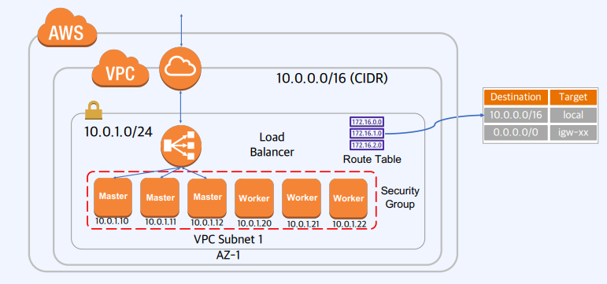
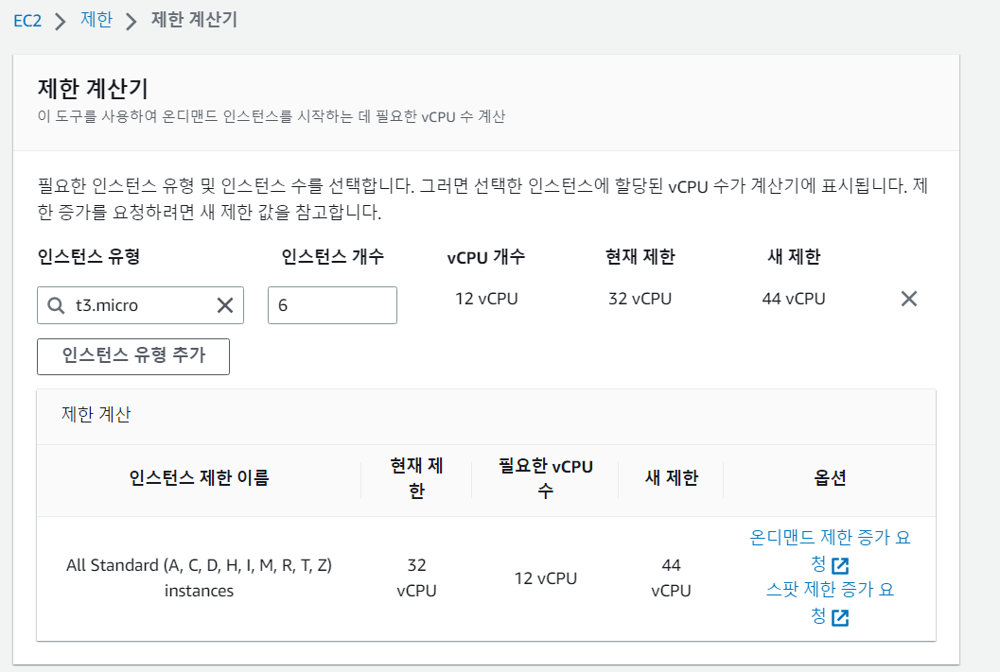

# 1. 가상머신 프로비저닝

**가상 데이터 센터(VPC) 구성**
   - 사용자가 정의한 가상의 네트워크 환경(논리적 격리) 구성
   

```shell
SUBNET_ID=$(aws ec2 create-subnet \
  --vpc-id ${VPC_ID} \
  --cidr-block 10.0.1.0/24 \
  --output text --query 'Subnet.SubnetId')
aws ec2 create-tags --resources ${SUBNET_ID} --tags Key=Name,Value=kubernetes
```


----
**생성할 자원**

1. Subnet
  - 목적에 맞게 서버 자원을 구성할 세부 네트워크 환경 구성

```shell
SUBNET_ID=$(aws ec2 create-subnet \
  --vpc-id ${VPC_ID} \
  --cidr-block 10.0.1.0/24 \
  --output text --query 'Subnet.SubnetId')
aws ec2 create-tags --resources ${SUBNET_ID} --tags Key=Name,Value=kubernetes
```

---
2. Internet Gateway
   - 외부 네트워크 접속을 위한 게이트웨이

```shell
INTERNET_GATEWAY_ID=$(aws ec2 create-internet-gateway --output text --query 'InternetGateway.InternetGatewayId')
aws ec2 create-tags --resources ${INTERNET_GATEWAY_ID} --tags Key=Name,Value=kubernetes
aws ec2 attach-internet-gateway --internet-gateway-id ${INTERNET_GATEWAY_ID} --vpc-id ${VPC_ID}
```

---
3. Route tables
 - 네트워크 라우팅 규칙 정의

```shell
ROUTE_TABLE_ID=$(aws ec2 create-route-table --vpc-id ${VPC_ID} --output text --query 'RouteTable.RouteTableId')
aws ec2 create-tags --resources ${ROUTE_TABLE_ID} --tags Key=Name,Value=kubernetes
aws ec2 associate-route-table --route-table-id ${ROUTE_TABLE_ID} --subnet-id ${SUBNET_ID}
aws ec2 create-route --route-table-id ${ROUTE_TABLE_ID} --destination-cidr-block 0.0.0.0/0 --gateway-id ${INTERNET_GATEWAY_ID}
```

---
4. Security Groups
 - 해당 그룹에 속한 서버의 네트워크 접속을 제한 (방화벽 설정) 
 - `Stateful` 방화벽
   - 인바운드 규칙을 통과한 요청의 경우 응답을 전달 가능 (아웃바운드 규칙 따로 설정할 필요없음)

```shell
SECURITY_GROUP_ID=$(aws ec2 create-security-group \
  --group-name kubernetes \
  --description "Kubernetes security group" \
  --vpc-id ${VPC_ID} \
  --output text --query 'GroupId')
aws ec2 create-tags --resources ${SECURITY_GROUP_ID} --tags Key=Name,Value=kubernetes
aws ec2 authorize-security-group-ingress --group-id ${SECURITY_GROUP_ID} --protocol all --cidr 10.0.0.0/16
aws ec2 authorize-security-group-ingress --group-id ${SECURITY_GROUP_ID} --protocol all --cidr 10.200.0.0/16
aws ec2 authorize-security-group-ingress --group-id ${SECURITY_GROUP_ID} --protocol tcp --port 22 --cidr 0.0.0.0/0
aws ec2 authorize-security-group-ingress --group-id ${SECURITY_GROUP_ID} --protocol tcp --port 6443 --cidr 0.0.0.0/0
aws ec2 authorize-security-group-ingress --group-id ${SECURITY_GROUP_ID} --protocol tcp --port 443 --cidr 0.0.0.0/0
aws ec2 authorize-security-group-ingress --group-id ${SECURITY_GROUP_ID} --protocol icmp --port -1 --cidr 0.0.0.0/0
```


---
5. Load Balancer 구성
 - Network Load Balancer (L4 레벨)
 - K8s API 서버 클러스터에 요청을 분배


```shell
  LOAD_BALANCER_ARN=$(aws elbv2 create-load-balancer \
    --name kubernetes \
    --subnets ${SUBNET_ID} \
    --scheme internet-facing \
    --type network \
    --output text --query 'LoadBalancers[].LoadBalancerArn')
  TARGET_GROUP_ARN=$(aws elbv2 create-target-group \
    --name kubernetes \
    --protocol TCP \
    --port 6443 \
    --vpc-id ${VPC_ID} \
    --target-type ip \
    --output text --query 'TargetGroups[].TargetGroupArn')
  aws elbv2 register-targets --target-group-arn ${TARGET_GROUP_ARN} --targets Id=10.0.1.1{0,1,2}
  aws elbv2 create-listener \
    --load-balancer-arn ${LOAD_BALANCER_ARN} \
    --protocol TCP \
    --port 443 \
    --default-actions Type=forward,TargetGroupArn=${TARGET_GROUP_ARN} \
    --output text --query 'Listeners[].ListenerArn'
```

```shell
KUBERNETES_PUBLIC_ADDRESS=$(aws elbv2 describe-load-balancers \
  --load-balancer-arns ${LOAD_BALANCER_ARN} \
  --output text --query 'LoadBalancers[].DNSName')
```

---
6. EC2 구성
 - t3.micro (2v CPU, 1GiB)
 - 6개의 인스턴스
 - 필요한 자원 (12 vCPU)
 - [만약 vCPU가 부족하다면 할당을 요청해야함](https://support.console.aws.amazon.com/support/home#/case/create?issueType=service-limit-increase&limitType=ec2-instances)
 
 


**Instance Image**

```shell
sudo apt update
sudo apt install -y jq

IMAGE_ID=$(aws ec2 describe-images --owners 099720109477 \
  --output json \
  --filters \
  'Name=root-device-type,Values=ebs' \
  'Name=architecture,Values=x86_64' \
  'Name=name,Values=ubuntu/images/hvm-ssd/ubuntu-focal-20.04-amd64-server-*' \
  | jq -r '.Images|sort_by(.Name)[-1]|.ImageId')
```

**SSH Key Pair**

```shell
mkdir ~/k8s-demo
cd ~/k8s-demo
aws ec2 create-key-pair --key-name kubernetes --output text --query 'KeyMaterial' > kubernetes.id_rsa
chmod 600 kubernetes.id_rsa
```

**Master Node**
- `t3.micro` 인스턴스

```shell
for i in 0 1 2; do
  instance_id=$(aws ec2 run-instances \
    --associate-public-ip-address \
    --image-id ${IMAGE_ID} \
    --count 1 \
    --key-name kubernetes \
    --security-group-ids ${SECURITY_GROUP_ID} \
    --instance-type t3.micro \
    --private-ip-address 10.0.1.1${i} \
    --user-data "name=controller-${i}" \
    --subnet-id ${SUBNET_ID} \
    --block-device-mappings='{"DeviceName": "/dev/sda1", "Ebs": { "VolumeSize": 50 }, "NoDevice": "" }' \
    --output text --query 'Instances[].InstanceId')
  aws ec2 modify-instance-attribute --instance-id ${instance_id} --no-source-dest-check
  aws ec2 create-tags --resources ${instance_id} --tags "Key=Name,Value=controller-${i}"
  echo "controller-${i} created "
done
```

**Worker Node**
```shell
for i in 0 1 2; do
  instance_id=$(aws ec2 run-instances \
    --associate-public-ip-address \
    --image-id ${IMAGE_ID} \
    --count 1 \
    --key-name kubernetes \
    --security-group-ids ${SECURITY_GROUP_ID} \
    --instance-type t3.micro \
    --private-ip-address 10.0.1.2${i} \
    --user-data "name=worker-${i}|pod-cidr=10.200.${i}.0/24" \
    --subnet-id ${SUBNET_ID} \
    --block-device-mappings='{"DeviceName": "/dev/sda1", "Ebs": { "VolumeSize": 50 }, "NoDevice": "" }' \
    --output text --query 'Instances[].InstanceId')
  aws ec2 modify-instance-attribute --instance-id ${instance_id} --no-source-dest-check
  aws ec2 create-tags --resources ${instance_id} --tags "Key=Name,Value=worker-${i}"
  echo "worker-${i} created"
done
```

