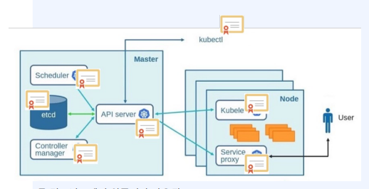
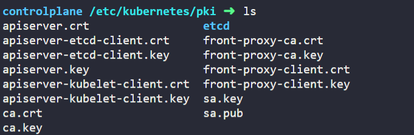
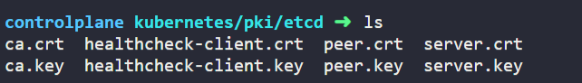
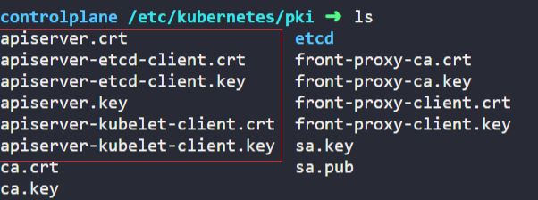
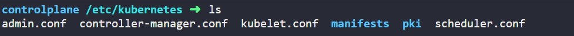
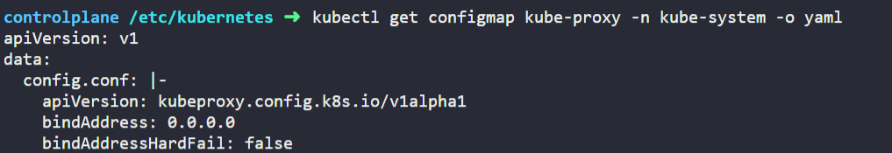

# 2. 인증서 생성

[**쿠버네티스 공식문서**](https://kubernetes.io/ko/docs/setup/best-practices/certificates/)

**목차**
1. 쿠버네티스에서 인증서가 필요한 이유?
2. 쿠버네티스 컴포넌트들의 인증서 활용
3. 인증과 인가
4. 인증서 발급 과정
5. 인증서 생성 실습

---
**1. 쿠버네티스에서 인증서가 필요한 이유?**




- 쿠버네티스에서 인증서는 노드 간 통신 및 클러스터 내부 통신을 보호하기 위해 사용된다.
- **인증서는 승인된 당사자만 중요한 정보에 액세스할 수 있고 네트워크를 통해 전송되는 데이터가 암호화되어 가로챌 수 없도록 한다.**
- 쿠버네티스에서 인증서를 사용하려면 `인증기관(CA)` 을 생성하고, 시스템의 여러 컴포넌트들에 대한 인증서를 발급해야한다. 이때, 자체 서명된 CA를 사용하거나 신뢰할 수 있는 타사 CA에서 인증서를 발급받을 수 있다.
- 인증서를 발급 받으면 이를 사용하기 위해 쿠버네티스 컴포넌트들에 대한 설정이 필요하다. 
- 설정 파일에는 **인증서의 경로**, **개인키**, **인증서 만료시점**, **사용량**등의 내용이 포함된다.

---
**2. 쿠버네티스 컴포넌트들의 인증서 활용**
- 인증서를 사용하여 컴포넌트간 통신을 보호함으로써 쿠버네티스 클러스터에서 데이터의 `기밀성`, `무결성` 및 `신뢰성`을 보장할 수 있다.
  
- `kubeadm`으로 쿠버네티스를 설치한 경우 인증서의 위치는 `/etc/kubernetes/pki`에 저장된다.


1. etcd
    컨테이너, 서비스 및 쿠버네티스 리소스 실행에 대한 정보를 포함하여 시스템 상태에 대한 정보를 저장하기 위해 사용되는 분산 Key-Value 저장소이다. 시스템 클러스터 전체에서 데이터를 저장하고 검색하는 안정적인 방법을 제공하며 장애가 발생한 경우에도 데이터를 항상 사용할 수 있도록 한다.
    
    **공개키 인프라(PKI)**
    
    - `etcd/ca.crt` :  etcd 공개키
    - `etcd/ca.key` : etcd 개인키
    - `etcd/server.crt`, `etcd/server.key`: ca.cert로 서명하고 ca.key로 식별하는데 사용되는 루트 CA 인증서 및 키이다.

<br>

2. kube-apiserver 
   쿠버네티스 API를 클라이언트에 노출하고 클러스터 상태를 관리하는 역할을 한다. API 서버는 Pod, Service 및 Deployment와 같은 쿠버네티스 리소스를 생성, 수정 및 삭제할 수 있는 Restful API를 제공한다.
    **공개키 인프라(PKI)**
   
    -    kube-api-server의 certificate file : `/etc/kubernetes/pki/apiserver.crt`
    - kube-apiserver의 ETCD Client certificate file : `/etc/kubernetes/pki/apiserver-etcd-client.crt`
    - kubeapi-server의 kubelet client key : `/etc/kubernetes/pki/apiserver-kubelet-client.key`
<br>

3. kube-controller-manager 
    시스템 상태를 모니터링하고 `Desired State`로 만들기 위한 조치를 취하는 컨트롤러 실행을 담당한다. 원하는 수의 Pod가 항상 실행되도록 보장하는 ReplicaSet과 같이 시스템의 다양한 측면을 관리하는 여러 내장 컨트롤러가 포함되어 있다.
    **controller-manager.conf**
    
    - Kubernetes API 서버에서 작동하는 다양한 컨트롤러를 관리하는 Kubernetes 컨트롤러 관리자에 대한 구성 
    - Kubernetes API 서버 및 인증 자격 증명의 위치
    
<br>

4. kube-scheduler 
   클러스터에서 실행할 워크로드를 예약하는 역할을 담당한다. resource availability, affinity, anti-affinity rules, 사용자 정의 정책과 같은 요소를 기반으로 각 Pod를 실행해야 하는 클러스터의 노드를 결정한다.
   **scheduler.conf**
    
    - 노드에 대한 워크로드 스케줄링을 담당하는 Kubernetes 스케줄러에 대한 구성 
    - Kubernetes API 서버 및 인증 자격 증명의 위치
   

<br>

5. kubelet 
    클러스터의 각 노드에서 실행되는 agent로, 컨테이너를 관리하고 노드 상태를 컨트롤 플레인에 보고하는 역할을 한다. kubelet은 컨테이너가 노드에서 실행되고 정상인지 확인하고 API 서버와 통신하여 실행할 워크로드에 대한 지침을 수신한다.
    **kubelet.conf**
     
    - 노드에서 컨테이너 관리를 담당하는 kubelet에 대한 구성
    - Kubernetes API 서버 및 인증 자격 증명의 위치
<br>

6. kube-proxy 
    트래픽을 쿠버네티스 서비스로 라우팅하는 역할을 담당한다. 클러스터의 각 노드에서 실행되며 트래픽이 적절한 서비스로 올바르게 라우팅되도록 네트워크 구성을 관리한다. 또한 서비스에 대한 로드 밸런싱을 구현하여 수신된 트래픽을 클러스터의 다른 노드에서 실행되는 동일한 서비스의 여러 인스턴스에 분산한다.
    - kube-proxy에 필요한 자격 증명은 일반적으로 클러스터의 전체 PKI 인프라의 일부로 관리
    - 일반적으로 kube-proxy 구성은 kube-system 네임스페이스의 kube-proxy라는 ConfigMap에 저장됨
    ```shell
    kubectl get configmap kube-proxy -n kube-system -o yaml
    ```
    

---

**3. 인증과 인가**


---
**4. 인증서 발급 과정**

---
**5. 인증서 생성 실습**

- 인증기관(Certificate Authority) 인증서 <- 모든 인증서 생성에 사용
    - ca-key.pem
    - ca.pem

- 어드민 클라이언트 인증서 
  - kubectl 실행을 위한 사용자 인증
  - admin-key.pem admin.pem

- 컨트롤러 매니저 클라이언트 인증서
  - kube-controller-manager-key.pem 
  - kube-controller-manager.pem

- 스케줄러 클라이언트 인증서
    - kube-scheduler-key.pem 
    - kube-scheduler.pem

- Kubernetes API 서버 인증서
  - kubernetes-key.pem 
  - kubernetes.pem

- 서비스 어카운트 인증서
  - 서비스 어카운트 토큰 전달에 사용 . API 서버에 필요.
  - service-account-key.pem - 
  - service-account.pem

- kubelet 클라이언트 인증서
    - worker-0-key.pem 
    - worker-0.pem 
    - worker-1-key.pem
    - worker-1.pem 
    - worker-2-key.pem
    - worker-2.pem

- Kube Proxy 클라이언트 인증서
  - kube-proxy-key.pem
  - kube-proxy.pem

---

**CA 프로비저닝 및 TLS 인증서 생성**

- `cfssl`을 사용하여 PKI 인프라를 프로비저닝
- `etcd`, `kube-apiserver`, `kube-controller`, `kube-scheduler`, `kubelet`, `kube-proxy` 구성 요소에 대한 TLS 인증서를 생성 

1. 인증 기관 (Certificate Authority)
   - `CA configuration file`
   - `certificate`
   - `private key`

```shell
cat > ca-config.json <<EOF
{
  "signing": {
    "default": {
      "expiry": "8760h"
    },
    "profiles": {
      "kubernetes": {
        "usages": ["signing", "key encipherment", "server auth", "client auth"],
        "expiry": "8760h"
      }
    }
  }
}
EOF

cat > ca-csr.json <<EOF
{
  "CN": "Kubernetes",
  "key": {
    "algo": "rsa",
    "size": 2048
  },
  "names": [
    {
      "C": "US",
      "L": "Portland",
      "O": "Kubernetes",
      "OU": "CA",
      "ST": "Oregon"
    }
  ]
}
EOF

cfssl gencert -initca ca-csr.json | cfssljson -bare ca

# 결과

ca-key.pem
ca.pem

```
---

2. `admin` 클라이언트 인증서

```shell
cat > admin-csr.json <<EOF
{
  "CN": "admin",
  "key": {
    "algo": "rsa",
    "size": 2048
  },
  "names": [
    {
      "C": "US",
      "L": "Portland",
      "O": "system:masters",
      "OU": "Kubernetes The Hard Way",
      "ST": "Oregon"
    }
  ]
}
EOF

cfssl gencert \
  -ca=ca.pem \
  -ca-key=ca-key.pem \
  -config=ca-config.json \
  -profile=kubernetes \
  admin-csr.json | cfssljson -bare admin

# 결과

admin-key.pem
admin.pem
```

---

3. Kubelet 클라이언트 인증서
   - Kubernetes uses a special-purpose authorization mode called Node Authorizer, that specifically authorizes API requests made by Kubelets. In order to be authorized by the Node Authorizer, Kubelets must use a credential that identifies them as being in the system:nodes group, with a username of system:node:<nodeName>. In this section you will create a certificate for each Kubernetes worker node that meets the Node Authorizer requirements.
    - 워커 노드 각각에 대한 인증서와 비밀키 생성

```shell
for i in 0 1 2; do
  instance="worker-${i}"
  instance_hostname="ip-10-0-1-2${i}"
  cat > ${instance}-csr.json <<EOF
{
  "CN": "system:node:${instance_hostname}",
  "key": {
    "algo": "rsa",
    "size": 2048
  },
  "names": [
    {
      "C": "US",
      "L": "Portland",
      "O": "system:nodes",
      "OU": "Kubernetes The Hard Way",
      "ST": "Oregon"
    }
  ]
}
EOF

  external_ip=$(aws ec2 describe-instances --filters \
    "Name=tag:Name,Values=${instance}" \
    "Name=instance-state-name,Values=running" \
    --output text --query 'Reservations[].Instances[].PublicIpAddress')

  internal_ip=$(aws ec2 describe-instances --filters \
    "Name=tag:Name,Values=${instance}" \
    "Name=instance-state-name,Values=running" \
    --output text --query 'Reservations[].Instances[].PrivateIpAddress')

  cfssl gencert \
    -ca=ca.pem \
    -ca-key=ca-key.pem \
    -config=ca-config.json \
    -hostname=${instance_hostname},${external_ip},${internal_ip} \
    -profile=kubernetes \
    worker-${i}-csr.json | cfssljson -bare worker-${i}
done

# 결과
worker-0-key.pem
worker-0.pem
worker-1-key.pem
worker-1.pem
worker-2-key.pem
worker-2.pem
```

---

4. Controller Manager 클라이언트 인증서


```shell
cat > kube-controller-manager-csr.json <<EOF
{
  "CN": "system:kube-controller-manager",
  "key": {
    "algo": "rsa",
    "size": 2048
  },
  "names": [
    {
      "C": "US",
      "L": "Portland",
      "O": "system:kube-controller-manager",
      "OU": "Kubernetes The Hard Way",
      "ST": "Oregon"
    }
  ]
}
EOF

cfssl gencert \
  -ca=ca.pem \
  -ca-key=ca-key.pem \
  -config=ca-config.json \
  -profile=kubernetes \
  kube-controller-manager-csr.json | cfssljson -bare kube-controller-manager

# 결과

kube-controller-manager-key.pem
kube-controller-manager.pem
```
---

5. kube proxy 클라이언트 인증서

```shell
cat > kube-proxy-csr.json <<EOF
{
  "CN": "system:kube-proxy",
  "key": {
    "algo": "rsa",
    "size": 2048
  },
  "names": [
    {
      "C": "US",
      "L": "Portland",
      "O": "system:node-proxier",
      "OU": "Kubernetes The Hard Way",
      "ST": "Oregon"
    }
  ]
}
EOF

cfssl gencert \
  -ca=ca.pem \
  -ca-key=ca-key.pem \
  -config=ca-config.json \
  -profile=kubernetes \
  kube-proxy-csr.json | cfssljson -bare kube-proxy

# 결과
kube-proxy-key.pem
kube-proxy.pem

```

6. kube-scheduler 클라이언트 인증서

```shell
cat > kube-scheduler-csr.json <<EOF
{
  "CN": "system:kube-scheduler",
  "key": {
    "algo": "rsa",
    "size": 2048
  },
  "names": [
    {
      "C": "US",
      "L": "Portland",
      "O": "system:kube-scheduler",
      "OU": "Kubernetes The Hard Way",
      "ST": "Oregon"
    }
  ]
}
EOF

cfssl gencert \
  -ca=ca.pem \
  -ca-key=ca-key.pem \
  -config=ca-config.json \
  -profile=kubernetes \
  kube-scheduler-csr.json | cfssljson -bare kube-scheduler

# 결과
kube-scheduler-key.pem
kube-scheduler.pem

```

---

7. Kubernetes API 서버 인증서
    - The kubernetes-the-hard-way static IP address will be included in the list of subject alternative names for the Kubernetes API Server certificate. This will ensure the certificate can be validated by remote clients.
    - The Kubernetes API server is automatically assigned the kubernetes internal dns name, which will be linked to the first IP address (10.32.0.1) from the address range (10.32.0.0/24) reserved for internal cluster services during the control plane bootstrapping lab.

```shell
KUBERNETES_HOSTNAMES=kubernetes,kubernetes.default,kubernetes.default.svc,kubernetes.default.svc.cluster,kubernetes.svc.cluster.local

KUBERNETES_PUBLIC_ADDRESS=$(aws elbv2 describe-load-balancers \
  --load-balancer-arns ${LOAD_BALANCER_ARN} \
  --output text --query 'LoadBalancers[].DNSName')

cat > kubernetes-csr.json <<EOF
{
  "CN": "kubernetes",
  "key": {
    "algo": "rsa",
    "size": 2048
  },
  "names": [
    {
      "C": "US",
      "L": "Portland",
      "O": "Kubernetes",
      "OU": "Kubernetes The Hard Way",
      "ST": "Oregon"
    }
  ]
}
EOF

cfssl gencert \
  -ca=ca.pem \
  -ca-key=ca-key.pem \
  -config=ca-config.json \
  -hostname=10.32.0.1,10.0.1.10,10.0.1.11,10.0.1.12,${KUBERNETES_PUBLIC_ADDRESS},127.0.0.1,${KUBERNETES_HOSTNAMES} \
  -profile=kubernetes \
  kubernetes-csr.json | cfssljson -bare kubernetes

# 결과
kubernetes-key.pem
kubernetes.pem

```
---

8. 서비스 어카운트 키페어
    - The Kubernetes Controller Manager leverages a key pair to generate and sign service account tokens as described in the managing service accounts documentation.

```shell
cat > service-account-csr.json <<EOF
{
  "CN": "service-accounts",
  "key": {
    "algo": "rsa",
    "size": 2048
  },
  "names": [
    {
      "C": "US",
      "L": "Portland",
      "O": "Kubernetes",
      "OU": "Kubernetes The Hard Way",
      "ST": "Oregon"
    }
  ]
}
EOF

cfssl gencert \
  -ca=ca.pem \
  -ca-key=ca-key.pem \
  -config=ca-config.json \
  -profile=kubernetes \
  service-account-csr.json | cfssljson -bare service-account

# 결과
service-account-key.pem
service-account.pem
```

---

9. 인증서 분배

- 워커노드 분배
```shell
for instance in worker-0 worker-1 worker-2; do
  external_ip=$(aws ec2 describe-instances --filters \
    "Name=tag:Name,Values=${instance}" \
    "Name=instance-state-name,Values=running" \
    --output text --query 'Reservations[].Instances[].PublicIpAddress')

  scp -i kubernetes.id_rsa ca.pem ${instance}-key.pem ${instance}.pem ubuntu@${external_ip}:~/
done
```

- 컨트롤러 노드 분배
```shell
for instance in controller-0 controller-1 controller-2; do
  external_ip=$(aws ec2 describe-instances --filters \
    "Name=tag:Name,Values=${instance}" \
    "Name=instance-state-name,Values=running" \
    --output text --query 'Reservations[].Instances[].PublicIpAddress')

  scp -i kubernetes.id_rsa \
    ca.pem ca-key.pem kubernetes-key.pem kubernetes.pem \
    service-account-key.pem service-account.pem ubuntu@${external_ip}:~/
done
```

---
추가적으로 공부할 것

- TODO
  - X.509 인증 & 인가 방법에 대한 정리
  - 실습 과정 스크린샷
  
- [X.509 Client Certs: X.509 인증서를 이용한 상호 TLS 인증](https://coffeewhale.com/kubernetes/authentication/x509/2020/05/02/auth01/)
- [HTTP Authentication: HTTP Authentication을 이용한 사용자 인증](https://coffeewhale.com/kubernetes/authentication/http-auth/2020/05/03/auth02/)
- [OpenID Connect: Google OAuth와 같은 인증 provider를 이용한 인증](https://coffeewhale.com/kubernetes/authentication/oidc/2020/05/04/auth03/)
- [Webhook 인증: Webhook 인증서버를 통한 사용자 인증](https://coffeewhale.com/kubernetes/authentication/webhook/2020/05/05/auth04/)
- [Proxy Auth: Proxy 서버를 통한 대리 인증](https://coffeewhale.com/kubernetes/authentication/x509/2020/05/02/auth01/)