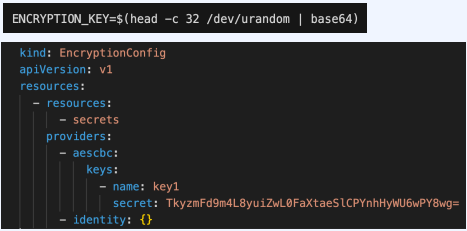

# 4. 데이터 암호화 관련 설정 구성

- Kubernetes는 기밀 데이터 관리를 지원한다.
 - 암호, 토큰, 키 등 작은 크기의 중요 데이터를 `Secret` 오브젝트에 저장할 수 있다. 
   - ex) DB 인증정보, 외부 API 키 등
- Etcd에 저장할 데이터를 암호화 하기 위한 설정이 필요
- `EncryptionConfiguration` 리소스를 이용해 설정
- 암호화 키를 만들어서 암호화 설정 진행하는 실습
  
---
**암호화 키**

```shell
ENCRYPTION_KEY=$(head -c 32 /dev/urandom | base64)
```



---
**암호화 설정**

- `encryption-config.yaml`

```shell
cat > encryption-config.yaml <<EOF
kind: EncryptionConfig
apiVersion: v1
resources:
  - resources:
      - secrets
    providers:
      - aescbc:
          keys:
            - name: key1
              secret: ${ENCRYPTION_KEY}
      - identity: {}
EOF
```

- 이 config 파일을 각 controller instance에 복사한다.

```shell
for instance in controller-0 controller-1 controller-2; do
  external_ip=$(aws ec2 describe-instances --filters \
    "Name=tag:Name,Values=${instance}" \
    "Name=instance-state-name,Values=running" \
    --output text --query 'Reservations[].Instances[].PublicIpAddress')
  
  scp -i kubernetes.id_rsa encryption-config.yaml ubuntu@${external_ip}:~/
done
```