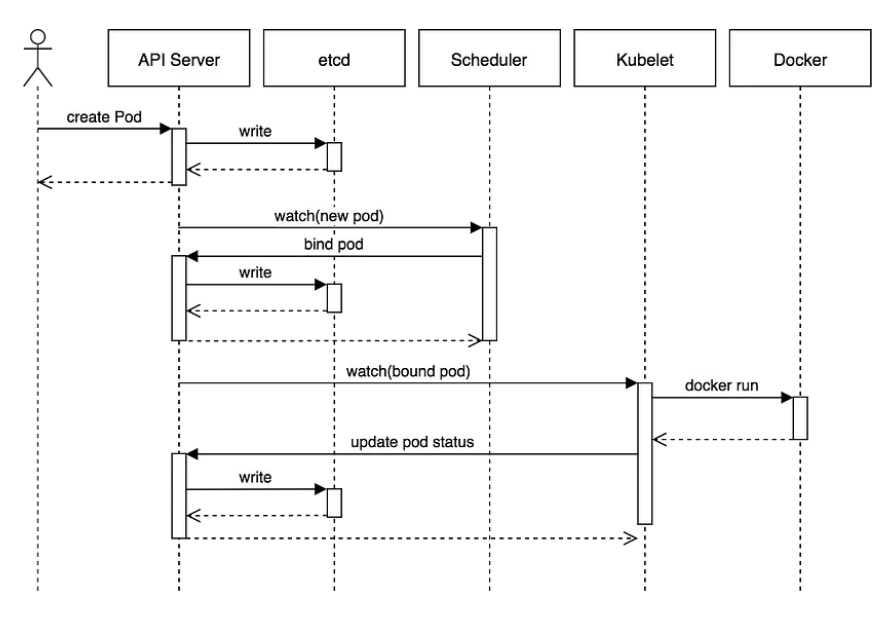

# 5. etcd 클러스터 생성

**etcd**
- 분산 시스템에서 사용할 수 있는 분산형 키-값 저장소
- kubernetes, CoreDNS 등에서 사용
- 쿠버네티스는 etcd를 기본 데이터 저장소로 사용한다.
- etcd는 쿠버네티스 클러스터의 모든 상태를 저장한다.
  - ex) 클러스터 노드 개수, pod가 어떤 노드에서 실행되고 있는지 정보



---

**Prerequisites**
- 실습 명령어는 각 컨트롤러 인스턴스 (controller-0, 1, 2) 에서 실행돼야한다.
- ssh 명령어를 사용하여 controller 인스턴스에 로그인한다.

```shell
for instance in controller-0 controller-1 controller-2; do
  external_ip=$(aws ec2 describe-instances --filters \
    "Name=tag:Name,Values=${instance}" \
    "Name=instance-state-name,Values=running" \
    --output text --query 'Reservations[].Instances[].PublicIpAddress')

  echo ssh -i kubernetes.id_rsa ubuntu@$external_ip
done
```

---

**tmux로 병렬 명령어 실행**

---

**etcd 클러스터 멤버구성**

1. etcd 바이너리 다운로드 및 설치

- etcd 깃허브 프로젝트로부터 공식 바이너리를 다운로드하고 압축을 해제하고 폴더를 이동한다.
```shell
wget -q --show-progress --https-only --timestamping \
  "https://github.com/etcd-io/etcd/releases/download/v3.4.15/etcd-v3.4.15-linux-amd64.tar.gz"

tar -xvf etcd-v3.4.15-linux-amd64.tar.gz
sudo mv etcd-v3.4.15-linux-amd64/etcd* /usr/local/bin/
```
--- 
2. etcd 서버 구성
```shell
sudo mkdir -p /etc/etcd /var/lib/etcd
sudo chmod 700 /var/lib/etcd
sudo cp ca.pem kubernetes-key.pem kubernetes.pem /etc/etcd/
```
- 클라이언트 요청을 처리하고 etcd 클러스터 피어와 통신하는 데 사용된다. 
- 현재 인스턴스의 내부 IP 주소를 검색한다.

```shell
INTERNAL_IP=$(curl -s http://169.254.169.254/latest/meta-data/local-ipv4)
```

- 각 etcd 멤버는 클러스터 내에서 고유한 이름을 가져야한다.
- 현재 인스턴스의 호스트명과 일치하도록 etcd 이름을 설정한다

```shell
ETCD_NAME=$(curl -s http://169.254.169.254/latest/user-data/ \
  | tr "|" "\n" | grep "^name" | cut -d"=" -f2)
echo "${ETCD_NAME}"
```

- `etcd.service` systemd unit 파일을 생성한다.

```shell
cat <<EOF | sudo tee /etc/systemd/system/etcd.service
[Unit]
Description=etcd
Documentation=https://github.com/coreos

[Service]
Type=notify
ExecStart=/usr/local/bin/etcd \\
  --name ${ETCD_NAME} \\
  --cert-file=/etc/etcd/kubernetes.pem \\
  --key-file=/etc/etcd/kubernetes-key.pem \\
  --peer-cert-file=/etc/etcd/kubernetes.pem \\
  --peer-key-file=/etc/etcd/kubernetes-key.pem \\
  --trusted-ca-file=/etc/etcd/ca.pem \\
  --peer-trusted-ca-file=/etc/etcd/ca.pem \\
  --peer-client-cert-auth \\
  --client-cert-auth \\
  --initial-advertise-peer-urls https://${INTERNAL_IP}:2380 \\
  --listen-peer-urls https://${INTERNAL_IP}:2380 \\
  --listen-client-urls https://${INTERNAL_IP}:2379,https://127.0.0.1:2379 \\
  --advertise-client-urls https://${INTERNAL_IP}:2379 \\
  --initial-cluster-token etcd-cluster-0 \\
  --initial-cluster controller-0=https://10.0.1.10:2380,controller-1=https://10.0.1.11:2380,controller-2=https://10.0.1.12:2380 \\
  --initial-cluster-state new \\
  --data-dir=/var/lib/etcd
Restart=on-failure
RestartSec=5

[Install]
WantedBy=multi-user.target
EOF
```

3. etcd 서버 시작
- 아래 명령어를 `controller-0, 1, 2에서 실행한다.
```shell
sudo systemctl daemon-reload
sudo systemctl enable etcd
sudo systemctl start etcd
```

4. 결과 확인

- 클러스터 멤버를 출력한다.
```shell
sudo ETCDCTL_API=3 etcdctl member list \
  --endpoints=https://127.0.0.1:2379 \
  --cacert=/etc/etcd/ca.pem \
  --cert=/etc/etcd/kubernetes.pem \
  --key=/etc/etcd/kubernetes-key.pem
```

결과
```shell
bbeedf10f5bbaa0c, started, controller-2, https://10.0.1.12:2380, https://10.0.1.12:2379, false
f9b0e395cb8278dc, started, controller-0, https://10.0.1.10:2380, https://10.0.1.10:2379, false
eecdfcb7e79fc5dd, started, controller-1, https://10.0.1.11:2380, https://10.0.1.11:2379, false
```

