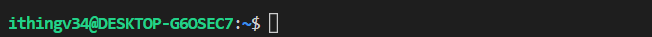
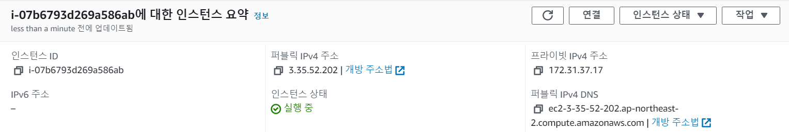
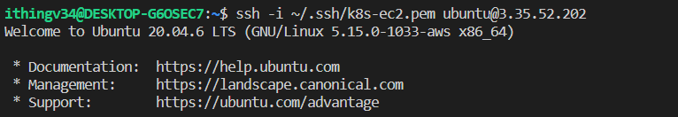
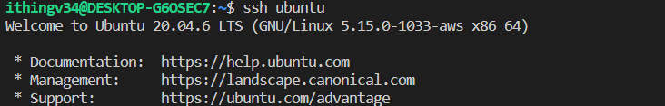
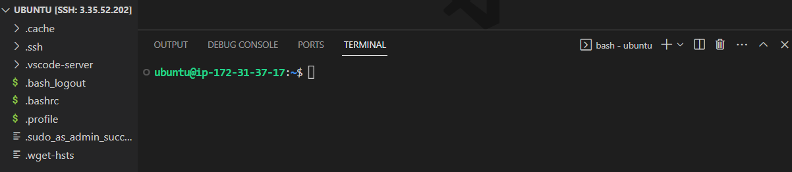

# WSL에서 AWS EC2 서버와 SSH 연결


1. Windows 시스템에서 WSL 터미널을 시작합니다. Windows 검색 표시줄에 "WSL"을 입력하고 "Ubuntu" 또는 설치한 다른 Linux 배포를 선택하면 됩니다.



2. 웹 브라우저에서 AWS Management Console을 열고 EC2 대시보드로 이동합니다. 연결할 EC2 인스턴스를 선택하고 퍼블릭 IP 주소를 기록해 둡니다.



3. WSL 터미널에서 다음 명령을 입력합니다.
- ec2 인스턴스 생성할 때 만든 key의 저장 경로는 `~/.ssh/k8s-ec2.pem` 입니다.
- key의 권한 변경 해야합니다. `chmod 400 ~/.ssh/k8s-ec2.pem`
```
ssh -i ~/.ssh/k8s-ec2.pem ubuntu@3.35.52.202
```


4. host로 ssh 바로 접속하기
   - `~/.ssh/config` 파일에 아래 내용을 입력한다. 
   - `HostName` 에는 ec2 퍼블릭 IP 주소를 입력해야 한다.
   - 파일을 저장하고 `ssh ubuntu`로 바로 접속할 수 있다. 단 ec2 IP가 변경될 경우 HostName 값을 변경 해줘야한다.

    ```shell
    Host ubuntu
      HostName 3.35.52.202
      IdentityFile ~/.ssh/k8s-ec2.pem
      User ubuntu
    ```
  
5. vscode 설정
   
  - Host ubuntu: 호스트의 이름을 지정합니다. 
  - HostName : EC2 인스턴스의 호스트 이름 또는 IP 주소를 지정합니다.
  - IdentityFile :  EC2 인스턴스 인증에 사용할 프라이빗 키 파일의 경로를 지정합니다.
  - User ubuntu:  EC2 인스턴스에 연결하는 데 사용할 사용자 이름을 지정합니다. 이 경우 AWS의 Ubuntu AMI에 대한 기본 사용자 이름입니다.

   ```shell
    Host ubuntu
      HostName 3.35.52.202
      IdentityFile C:/Users/l2t/.ssh/k8s-ec2.pem
      User ubuntu
   ```
